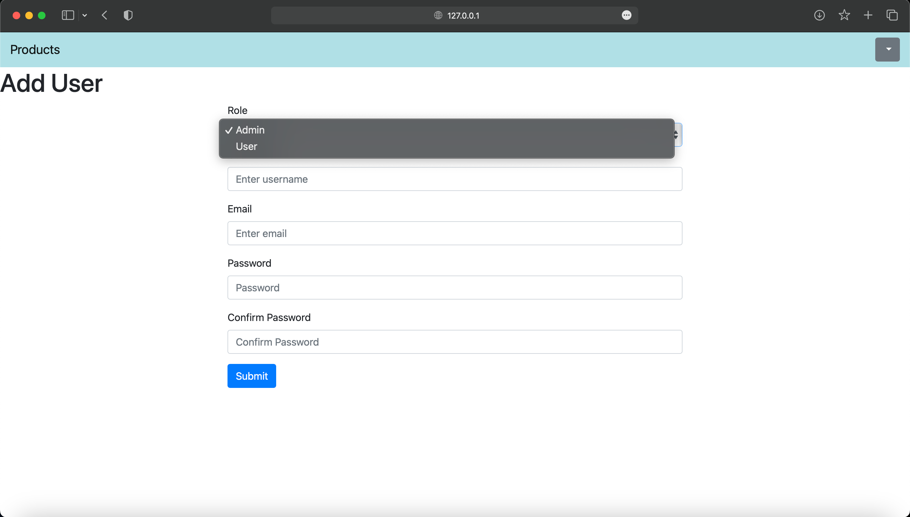
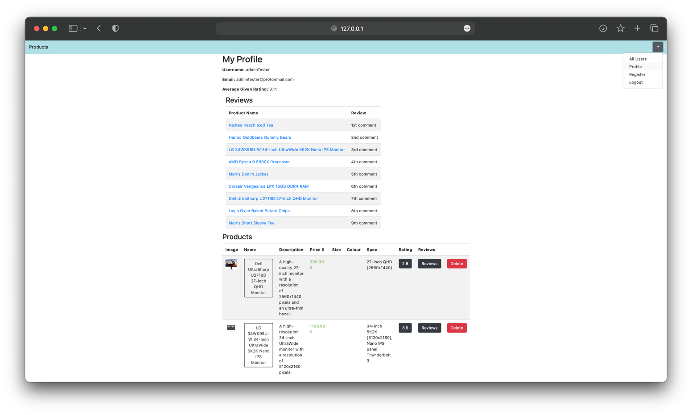

# CENG495 - HW1

## E-Commerce Web Application
https://e-commerce-5hio.onrender.com/

M. Tayyip OZTURK 
2380806

### Design Decisions
- I designed the application as it has minimum collections as possible. There is two collections named `users` and `items` in the database. 
- `users` collection stores the information of users such as `_id`, `username`, `password`, `email`, `role`, `rating`, the items that the user is selling in the type of `[<item_id>]`, the rating list they have given in the type of `[[<item_id>, <item_name>, <rate>]]`, and the review list they have given in the type of `[[<item_id>, <item_name>, <review>]]`. 
- `items` collection stores the information of items such as `_id`, `name`, `category`, `price`, `description`, `seller`, `rates` list, `rating` value, `reviews` list, `colour`, `size`, `spec`, `image_url`. `seller` is the `username` of the user who is selling the item and `seller_id` is the `_id` of the user who is selling the item. `rating` is the average rating of the item. `rates` is the list of rates given for the item in the type of `[[<user_id>, <user_name>, <rate>]]`, `reviews` is the list of reviews given for the item in the type of `[[<user_id>, <user_name>, <review>]]`. `image_url` is the url of the image of the item.

### User Guide

This is a simple e-commerce web application.
- The main page is the index page. It shows the products available in the database and filters for their categories. Filters are shown in the dropdown menu on the left upper side of the page. User can select a category from the dropdown menu to see the products of that category or many categories.

- User should login to the system to be able to see details of products such as reviews and the seller's profile by clicking on the name of the product and the name of the seller respectively. Also, after selecting the target categories from the `Filter` dropdown menu and clicking on the `Filter` button in the menu, products of the selected categories are shown in the main page.

- After logging in, user still can not add or remove products from the database. Only admins are eligible to add and remove products. Users can only review and rate products if they are logged in.

- By clicking on the `Add Product` button on the main page for the Admin, a form is shown to add a product to the database. The form redirected is different after choosing a category. For example, for the `Clothing` category, the form is shown below.

- Added products for a seller are shown in the seller's profile page, as well as user's reviews and average rating of ratings given by the user for all products reviewed or rated. Any user in any seller profile can redirect to another product by clicking on the product name which the seller is selling or the seller has reviewed. (Admins also have normal user capabilities such as reviewing and rating products or being a seller of a product.)

- Admin can see all users and their roles in the system.

- Admin can register new users to the system from `Add User` button on the `All Users` page in the dropdown menu on the right upper side of the page.

- Admin can update role of an existing user or delete a user from the system. If an admin updates its own role, it will be instantly updated in the database and the user will be redirected to the main page without logging out.

- Any user without a difference in role can see the details of their own profile by clicking the dropdown menu on the right upper side of the page and selecting the `Profile` option.

- Any user can also logout from the system by clicking the dropdown menu on the right upper side of the page and selecting the `Logout` option.

- Any addition of a new rating or deletion of the existing rating will change the relevant rating values both in affected product and affected user. The same is applicable for deletion of a product or a user.
- Any addition of a new review or deletion of the existing review will change the relevant reviews both in affected product and affected user. The same is applicable for deletion of a product or a user.

### Login Information For Testing
- There are 5 users in the database's `users` collection and their products, reviews and ratings in each product available in the `items` collection; consisting 2 admin user and 3 normal user. Their usernames, passwords and roles are shown below.

| Username     | Password | Role |
|--------------|----------| --- |
| tayyipozturk | ceng495  | admin |
| adminTester  | tester   | admin |
| userTester   | tester   | user |
| Alice        | 12345    | user |
| Bob          | 12345    | user |

### What is used in the project?
- Python 3.9.6
- Flask 1.1.4
- Werkzeug 0.16.0

### Why Flask?
- After a little research and the future development plans, I firstly decided to use `Django` for the project. However, I realized that `Django` is a bit overkill for this project. After that, I implemented a backend design with `Golang` (since I am familiar with it for a backend design) and `Echo` framework where I very lately recognize that `Render` does not support `Echo` framework. Since then, I ,again, wanted to use a programming language beyond what I know for the project development. Thus, I decided to use `Flask` framework with `Python` since they are easy to learn and implement for simple projects.
